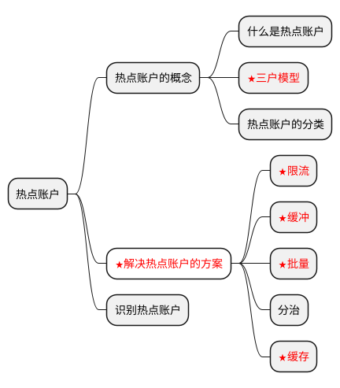

#### 背景介绍

一图胜千言，无论上在给别人讲解一些技术点，还是自己在阅读源码或者梳理自己的知识点时，将所学的知识图形化都是表达自己思想的一个很好的方式。但是图片文件有着不好编辑，不好修改的特点。如果简单的一些作图，关系不是非常复杂的图形，这里介绍一个通过语言来绘制图形的工具。想必大家对这个也不陌生。这里我也将一些常用的使用方式记录下来，作为以后的模板，供自己和大家使用。


#### 元素关系图

```plantuml
rectangle "客户" <<Customer>> #Yellow {
}
rectangle "用户" <<User>> #DodgerBlue {
}
rectangle "账户" <<Account>> #TECHNOLOGY {
}

客户|o-up-||用户
客户|o-up-||账户
用户||--left--||账户
```

>效果图：

<p align="center">
	
	<p align="center">
		<em>图1</em>
	</p>
</p>

>参考：

name | 参考 |  
-|-|-
关系 | [plantuml relation](https://plantuml.com/zh/ie-diagram) |
部署元素 | [plantuml deployment](https://plantuml.com/zh/deployment-diagram) |

#### 思维导图



>效果图：

<p align="center">
	
	<p align="center">
		<em>图1</em>
	</p>
</p>

>参考：

name | 参考 |  
-|-|-
颜色 | [plantuml color](https://plantuml.com/zh/creole) |
脑图 | [plantuml mapmind](https://plantuml.com/zh/mindmap-diagram) |


